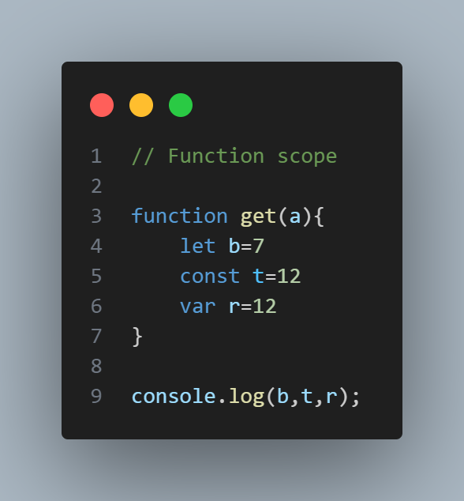
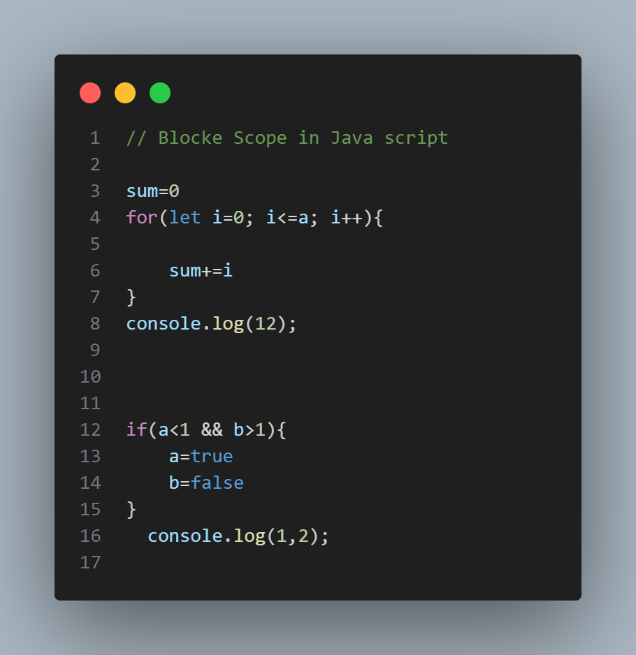
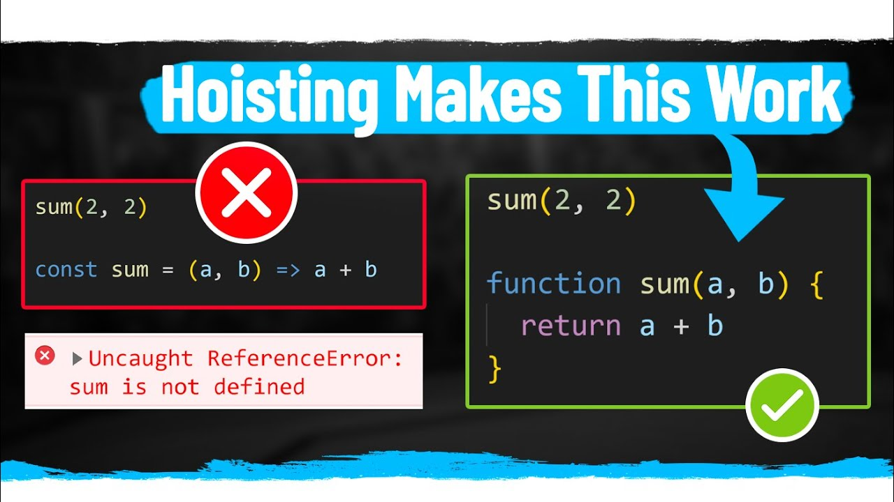
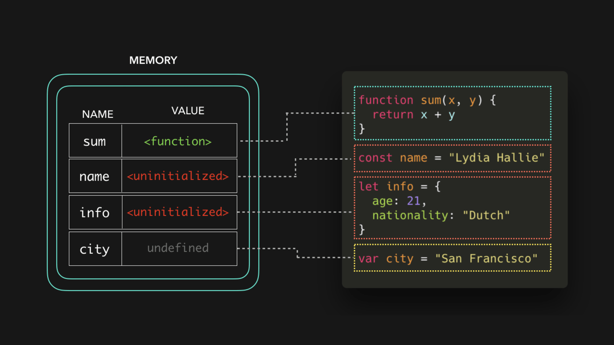
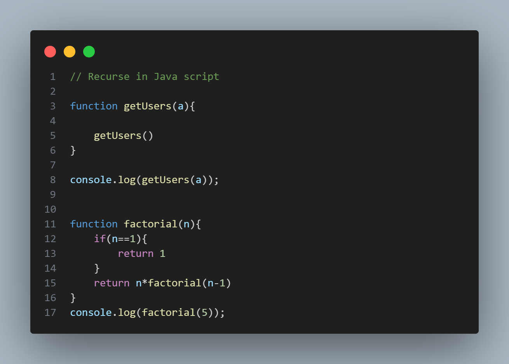
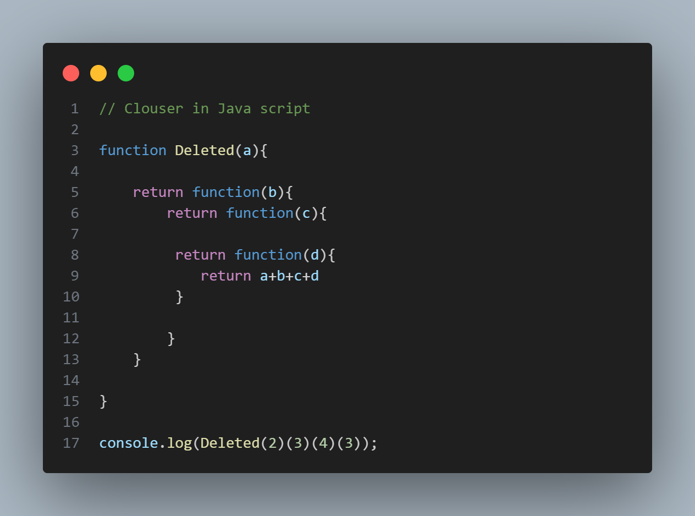

# Scope in Java Scpript

                            Java Script has 4 scopes 

 * Global Scope 
 * Function Scope 
 * Blocke Scope 
 * Module Scope                            


 ### Global Scope 

 ```
 область действия по умолчанию для всего кода, работающего в режиме сценария.
 ```
 

 ### Function Scope 

 ```
 Область действия, созданная с помощью функции.

```




### Blocke Scope 
```
Эта область ограничивает объявленную переменную
внутри определенного блока, от доступа снаружи блока.
```


### Module Scope 

```
Область действия кода, работающего в модульном режиме.
```


# Hosting in Java Script


```
Подъем — это механизм JavaScript, в котором переменные и функции
объявления перемещаются в верхнюю часть своей области перед кодом
исполнение.

```






# Recurce in Java Script

######  Действие функции, вызывающей саму себя, рекурсия используется для решения проблем, содержащих более мелкие подзадачи. Рекурсивная функция может получать два входа: базовый случай (завершает рекурсию) или рекурсивный случай (возобновляет рекурсию).




# Clouser

##### Замыкание — это комбинация функции, связанной вместе (приложенной) со ссылками на окружающее его состояние (лексическое окружение). Другими словами, замыкание дает вам доступ к области действия внешней функции из внутренней функции

